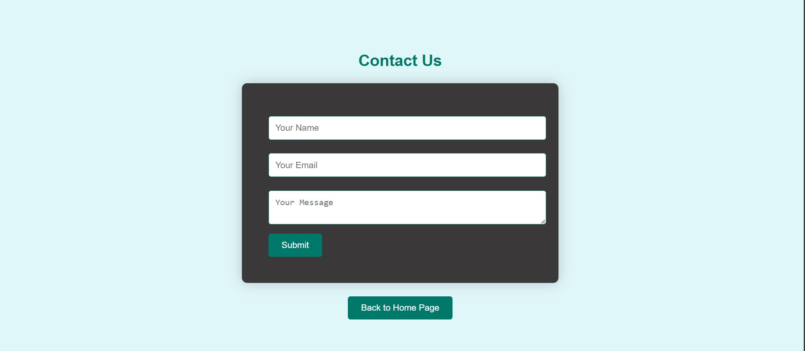

# Online Crime Report Management System

An Online Crime Report Management System built using HTML, CSS, JavaScript, PHP and MySQL. This project allows users to registers and report crimes online also the user can track the report status, and enables admistrators to manage reports efficiently through a secure admin panel.

## Features

- Crime report submission with crime type, location and description
- Unique user ID generation based on crime type (e.g., 'CYB001')
- Report status tracked by using user ID.
- Admin login with password hashing for security.
- Multiple admin account support (Superadmin,Moderator).
- Admin dashboard to manage and view crime reports.
- MySQL database integration for storing and managing data.

## Technologies Used

- **Frontend**: HTML, CSS and JavaScript
- **Backend**: PHP
- **Database**: MySQL

## Screenshots

### 1. Home Page1

### 2. Home page2

### 3. Crime Report Form

### 4. Track Report

### 5. Contact

### 6. Admin login

### 7. Admin Panel

## How to use

Follow the steps below to run this project on your local machine:

### 1. Clone the Repository

- Open the code editor(e.g: VS code), Open the "Terminal" and Choose 'Git bash'
  - Type inside the terminal: "git clone https://github.com/Pratyush-linux-quiter/Online-Crime-Report-Management-Project.git" (Don't use double cotation(""), it just for the navigation)

### 2. Move Project to Your Server Directory

- Download XAMPP FROM Apache Friends.
  - Move the project folder to C:\xampp\htdocs (visit file explorer on your local system
    then search for xampp then search htdocs inside your xampp after that paste your folder inside htdocs)

### 3. Start Your Server

- Open XAMPP
  - Start Apache and MySQL

### 4. Import the Databse

- Open phpMyAdmin (First way: To open PhpMyAdmin click on the "Admin" button beside the
  start button of MySQL)
  (SECOND WAY: Visit the link "http://localhost/phpmyadmin/" After
  starting your server)

  - Click import
  - Choose the database.sql file from the project folder
  - Click Go

### Access the System

- Open your browser and go to "http://localhost/crime%20report/index.html"

### Admin Section

- There are two admin one is "SuperAdmin" and other is "Moderator". "SuperAdmin" can access  
   everthing of the admin panel where moderator access limited thing . You can create many number of "superAdmin" and "Moderator" also you can delete them but all this actions are performed by using "SuperAdmin" only.

- For "SuperAdmin", Username: Gulu
  Password: Gulu@123

- For "Moderator", Username: Pratyush
  Password: Pratyush@123
  (-> You can change the username and password in databse. Remember in password case generate
  your password into hash password and then add it into you admin table. )

### Advice

- Sometime XAMPP server not worked properly or MySQL showing error and won't start. In this case if you export your data from the database it become more helpfull for you in future so always export your data from the database . So when ever you see some error occured, don't waste your time just delete the "XAMPP" and again download it and import your export data in database.

# License

This project is licensed under the MIT License--you are free to use,modify and share it with attribution. See the LICENSE file for details.

# Contact

Created by Pratyush Pal

- GitHub: Pratyush-linux-quiter
- Email: pratyushpal245@gmail.com
